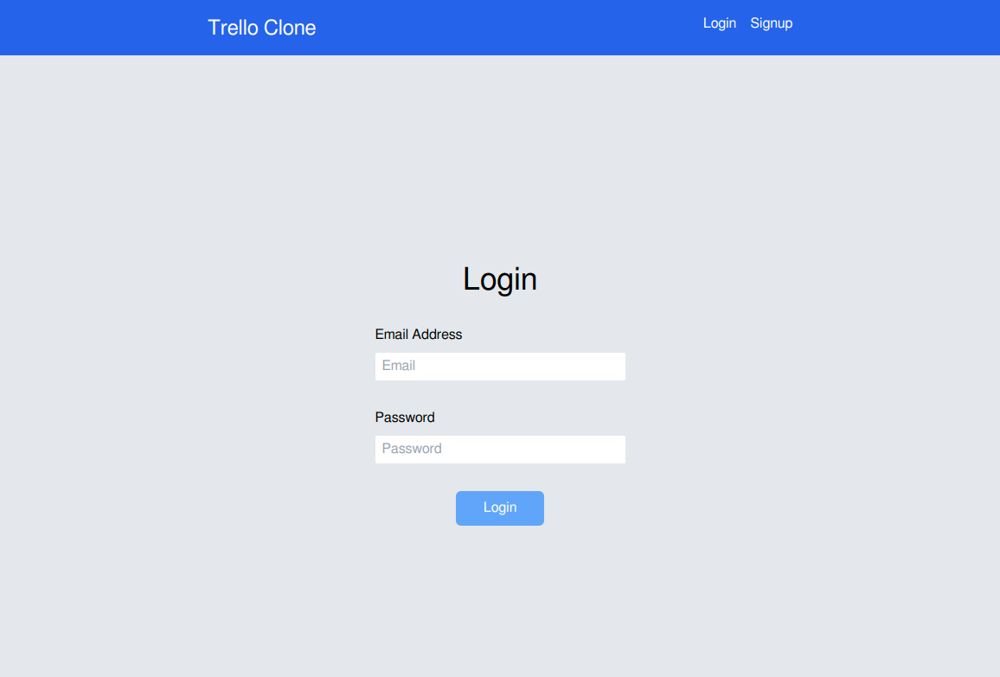
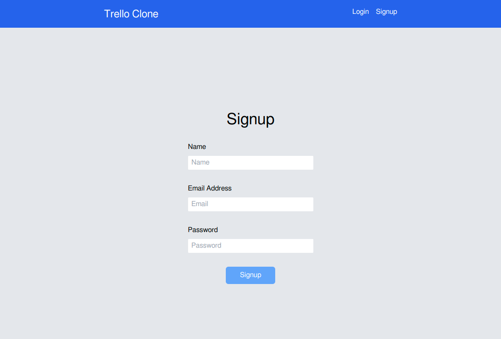
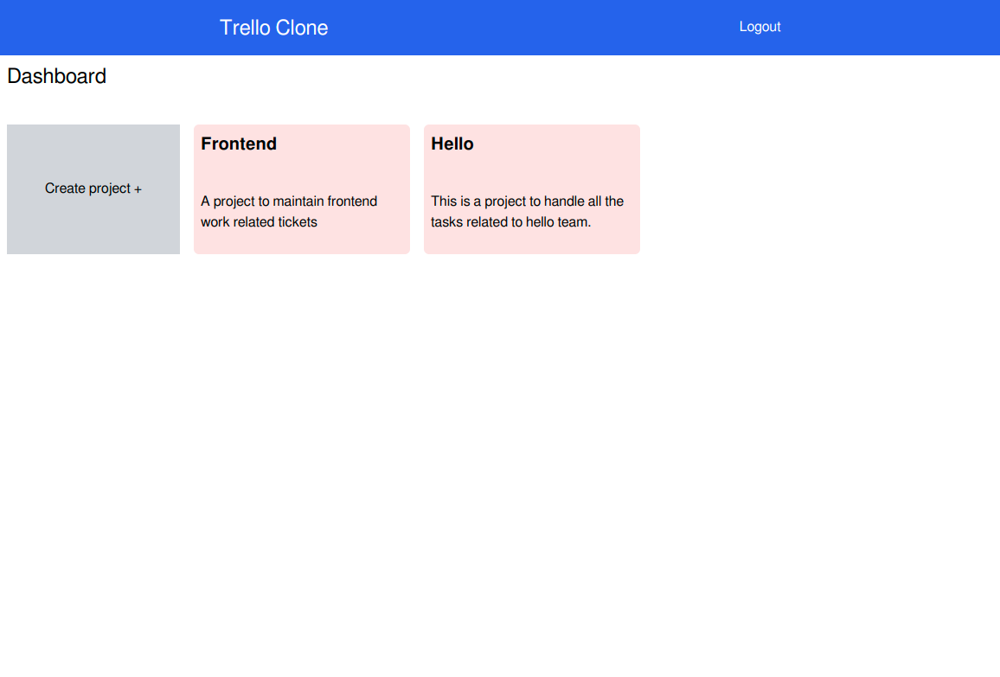
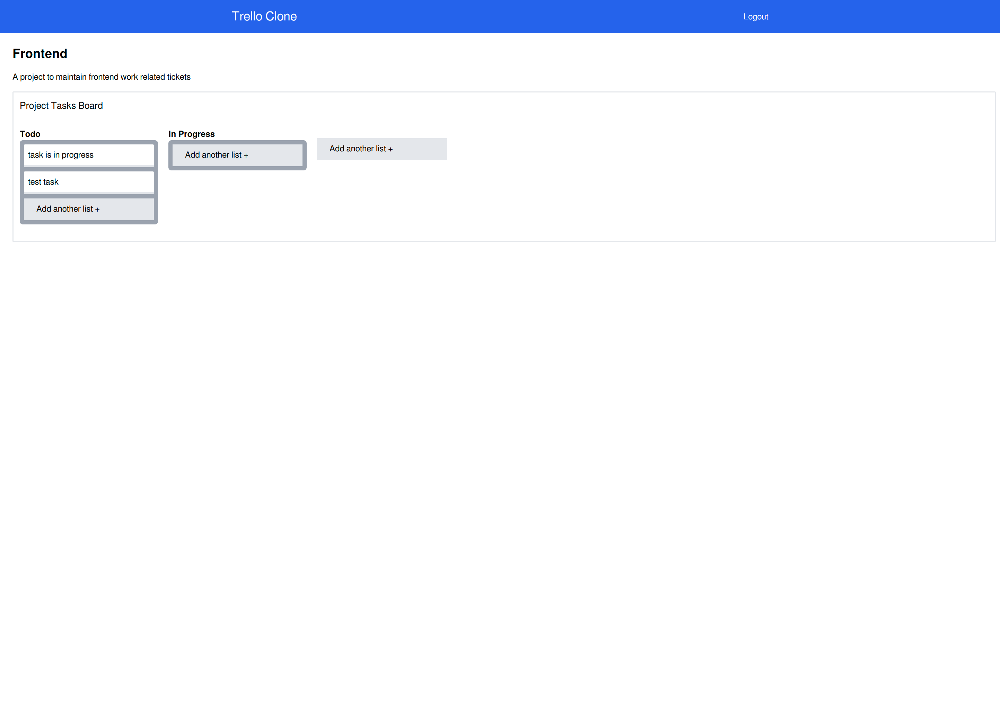

# Trello Clone

The project is clone trello basically a kanban board using react & tailwindcss.


## Tech Stack

**Client:** React, nanoid, TailwindCSS, react-router-dom, dnd-kit/core


## Run Locally

Clone the project

```bash
  git clone https://github.com/sridhar02/trello-clone
```

Go to the project directory

```bash
  cd trello-clone
```

Install dependencies

```bash
  npm install
```

Start the server

```bash
  npm run dev
```


## Screenshots

- Login



- Signup



- Dashboard



- Project




## Deployment

To deploy this project run

```bash
  npm run build
```


## Authors

- [@sridhar02](https://www.github.com/sridhar02)


